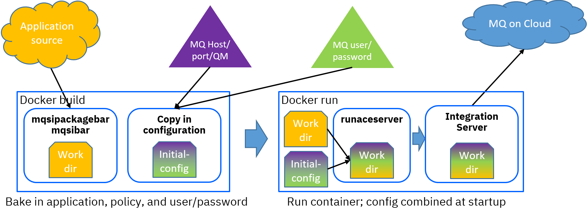

## acecc-baked-everything container image

This image is built with the ACE Certified Container (ACEcc; see https://hub.docker.com/r/ibmcom/ace-server for
information) and contains a sample application unpacked into the work directory plus MQ policy and credentials
placed in the initial-config directory. The [Dockerfile](Dockerfile.acecc-baked-everything) requires several
build arguments:
 - MQUSER=a valid MQ userid
 - MQPASS=a matching MQ password

Before building, it is usually necessary to customise the hostname, port, and queue manager name in the 
[MQoC policy](eclipse-projects/MQOnCloudPolicies/MQoC.policyxml) to avoid connection errors on startup.

ACEcc is designed to work with a Kubernetes operator, but can also be run standalone. The ACEcc startup code
reads from /home/aceuser/initial-config, so the MQ policy for this image will appear in the work directory 
in overrides/DefaultPolicies, rather than in run/MQOnCloudPolicies, and an overrides/server.conf.yaml
file directs the server to DefaultPolicies to ensure the MQoC policy is picked up.

Note that this image will contain the credentials for the MQ user, and these may be visible in the resulting 
Docker image even though they appear to be used and discarded in the Docckerfile itself. This may be appropriate
for local testing, but it would be most unwise to publish the resulting image to a public registry on Dockerhub 
(for example).



### Instructions

Instructions are included at the top of the Dockerfile, but the essential commands are of the form
```
docker build -t acecc-baked-everything --build-arg MQUSER=user --build-arg MQPASS=pwd -f Dockerfile.acecc-baked-everything .
docker run -p 7600:7600 -p 7800:7800 -e LICENSE=accept --rm -ti acecc-baked-everything
```
at which point it is possible to use curl (or other equivalent) to run the flows to ensure MQ connectivity 
has been successful; the flows listen on URLs /putFlow and /getFlow and behave as follows (using SYSTEM.DEFAULT.LOCAL.QUEUE):
```
[kenya:/Development/tdolby] curl http://localhost:7800/putFlow
{"result":"successfully put message"}
[kenya:/Development/tdolby] curl http://localhost:7800/getFlow
{"messageText":"This is an MQ message from putFlow"}
```

See [README-flows.md](README-flows.md) for more information on the flows themselves.

This image is provided as a way to ensure that the server in the container can connect to MQ; it is not intended 
to be used in production.

## Error scenarios

See [README-errors.md](README-errors.md) for more information on various error scenarios and how the server responds.
