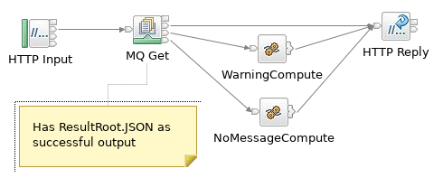

## Flows used in the containers

Two flows are used in the containers in this repo to illustrate the use of MQ connections.

The flows reside in an Eclipse project that can be imported into the ACE v11 toolkit using 
the egit plugin (version 4.11; needed to install from a downloaded p2 repo); the projects are 
in the eclipse-projects directory in this repo.

### Put Flow


The Put flow can be called via HTTP (URL /putFlow) to put a message to SYSTEM.DEFAULT.LOCAL.QUEUE
 with a JSON message body of 
```
{'messageText':'This is an MQ message from putFlow'}
```
and after a successful MQPUT will return a JSON success message as a reply.

### Get Flow


The second message flow can also be called via HTTP (URL /getFlow) to get a message from SYSTEM.DEFAULT.LOCAL.QUEUE
and return the contents in the HTTP Reply


### Example
```
[kenya:/Development/tdolby] curl http://localhost:7800/putFlow
{"result":"successfully put message"}
[kenya:/Development/tdolby] curl http://localhost:7800/getFlow
{"messageText":"This is an MQ message from putFlow"}
```
