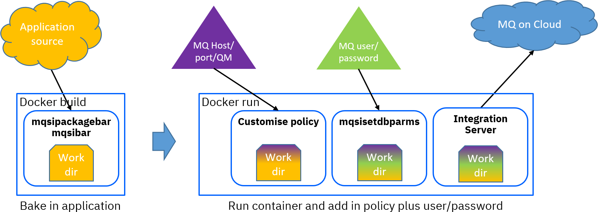

## simple-fried-allconfig container image

This image is built with ACE v11 Developer Edition and an MQ v9 client, with a sample application unpacked
into the work directory plus an MQ policy. The [Dockerfile](Dockerfile.simple-fried-allconfig) requires a
build argument of LICENSE=accept in order to build successfully, and downloads the required software from
IBM download sites.

This container does not require customisation of MQ policies at build time, as the relevant configuration
is passed in at container start time. User/pw, QM name, hostname, and port are all passed in, and used to
create credentials and replace template parameters in the remoteMQ.policyxml provided in the templates directory.

Note that user/pw information is passed in as environment variables, making it very easy to
see how the information is passed and used, but most container management systems will have other secure
ways to handle similar information (see [here](https://github.com/ot4i/ace-demo-pipeline/blob/demo-pipeline-20-08/scripts/preprod-container/init-creds.sh)
for one example using Kubernetes). 



### Instructions

Instructions are included at the top of the Dockerfile, but the essential commands are of the form
```
docker build -t simple-fried-allconfig --build-arg LICENSE=accept -f Dockerfile.simple-fried-allconfig .
docker run -e MQQMNAME=qmname -e MQHOST=host -e MQPORT=port -e MQUSER=user -e MQPASS=pwd -p 7600:7600 -p 7800:7800 --rm -ti simple-fried-allconfig
```
at which point it is possible to use curl (or other equivalent) to run the flows to ensure MQ connectivity 
has been successful; the flows listen on URLs /putFlow and /getFlow and behave as follows (using SYSTEM.DEFAULT.LOCAL.QUEUE):
```
[kenya:/Development/tdolby] curl http://localhost:7800/putFlow
{"result":"successfully put message"}
[kenya:/Development/tdolby] curl http://localhost:7800/getFlow
{"messageText":"This is an MQ message from putFlow"}
```

See [README-flows.md](README-flows.md) for more information on the flows themselves.

This image is provided as a way to ensure that the server in the container can connect to MQ; it is not intended 
to be used in production.

## Error scenarios

See [README-errors.md](README-errors.md) for more information on various error scenarios and how the server responds.
