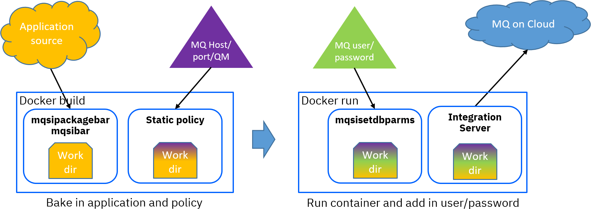

## simple-fried-userpw container image

This image is built with ACE v11 Developer Edition and an MQ v9 client, with a sample application unpacked
into the work directory plus an MQ policy. The [Dockerfile](Dockerfile.simple-fried-userpw) requires a
build argument of LICENSE=accept in order to build successfully, and downloads the required software from
IBM download sites.

Before building, it is usually necessary to customise the hostname, port, and queue manager name in the 
[MQoC policy](eclipse-projects/MQOnCloudPolicies/MQoC.policyxml) to avoid connection errors on startup.

Note that as this image does not contain the credentials for the MQ user, the user/pw information must be
passed in at container startup. Environment variables are used for this purpose, making it very easy to
see how the information is passed and used, but most container management systems will have other secure
ways to handle similar information. The hostname, port number, and queue manager name are baked into the
image at build time, and so that information is visible to anyone who can access the container image; this
information is much less confidential than user/pw information, but it may not be desirable to have it
available in a public registry on Dockerhub.



### Instructions

Instructions are included at the top of the Dockerfile, but the essential commands are of the form
```
docker build -t simple-fried-userpw --build-arg LICENSE=accept -f Dockerfile.simple-fried-userpw .
docker run -e MQUSER=user -e MQPASS=pwd -p 7600:7600 -p 7800:7800 --rm -ti simple-fried-userpw
```
at which point it is possible to use curl (or other equivalent) to run the flows to ensure MQ connectivity 
has been successful; the flows listen on URLs /putFlow and /getFlow and behave as follows (using SYSTEM.DEFAULT.LOCAL.QUEUE):
```
[kenya:/Development/tdolby] curl http://localhost:7800/putFlow
{"result":"successfully put message"}
[kenya:/Development/tdolby] curl http://localhost:7800/getFlow
{"messageText":"This is an MQ message from putFlow"}
```

This image is provided as a way to ensure that the server in the container can connect to MQ; it is not intended 
to be used in production.

## Error scenarios

### Invalid hostname
Incorrect hostname or port configuration will lead to the initial connection failing with an 
MQ code of 2538 (MQRC_HOST_NOT_AVAILABLE):

```
.....2021-04-21 14:02:20.315236: .2021-04-21 14:02:20.315444: BIP1990I: Integration server 'ace-server' starting initialization; version '11.0.0.12' (64-bit) 
.................................node.js process.on('exit') event emitted with exitCode of 0
main checker destroyed before initialisation completed, latest stage was MQ default CCSID, pid 1, tid 1, attempted stage was 40 and 39 stages completed
2021-04-21 14:02:25.416076: BIP2116E: IBM App Connect Enterprise internal error: diagnostic information 'Fatal Error; exception thrown before initialisation completed', 'MQ default CCSID', '1', '1', '40', '39'. 
2021-04-21 14:02:25.416176: BIP2203E: An integration server has encountered a problem whilst starting. 
2021-04-21 14:02:25.416224: BIP2677E: Failed to make a client connection to queue manager 'MQoC' using hostname 'mqoc-419f.qm.eu-gb.mq.appdomainWRONGWRONG.cloud' on port '31175': MQCC=2; MQRC=2538. 
2021-04-21 14:02:25.416298: BIP1992I: Integration server 'ace-server' stopped. 
```
In this case, the credentials will not have been used, and may also be invalid, but the server never had a chance to find out.

### Invalid user/password
Incorrect user/password information will lead to the initial connection failing with an 
MQ code of 2035 (MQRC_NOT_AUTHORIZED):
```
.....2021-04-21 13:59:23.306262: .2021-04-21 13:59:23.306478: BIP1990I: Integration server 'ace-server' starting initialization; version '11.0.0.12' (64-bit) 
.................................node.js process.on('exit') event emitted with exitCode of 0
main checker destroyed before initialisation completed, latest stage was MQ default CCSID, pid 1, tid 1, attempted stage was 40 and 39 stages completed
2021-04-21 13:59:37.404816: BIP2116E: IBM App Connect Enterprise internal error: diagnostic information 'Fatal Error; exception thrown before initialisation completed', 'MQ default CCSID', '1', '1', '40', '39'. 
2021-04-21 13:59:37.404912: BIP2203E: An integration server has encountered a problem whilst starting. 
2021-04-21 13:59:37.404952: BIP2677E: Failed to make a client connection to queue manager 'MQoC' using hostname 'mqoc-419f.qm.eu-gb.mq.appdomain.cloud' on port '31175': MQCC=2; MQRC=2035. 
2021-04-21 13:59:37.405016: BIP1992I: Integration server 'ace-server' stopped. 
```

### Invalid QM name
Incorrect queue manager information will lead to the initial connection failing with an 
MQ code of 2058 (MQRC_Q_MGR_NAME_ERROR):
```
.....2021-04-21 13:59:23.306262: .2021-04-21 13:59:23.306478: BIP1990I: Integration server 'ace-server' starting initialization; version '11.0.0.12' (64-bit) 
.................................node.js process.on('exit') event emitted with exitCode of 0
main checker destroyed before initialisation completed, latest stage was MQ default CCSID, pid 1, tid 1, attempted stage was 40 and 39 stages completed
2021-04-26 13:20:01.189568: BIP2116E: IBM App Connect Enterprise internal error: diagnostic information 'Fatal Error; exception thrown before initialisation completed', 'MQ default CCSID', '1', '1', '40', '39'. 
2021-04-26 13:20:01.189646: BIP2203E: An integration server has encountered a problem whilst starting. 
2021-04-26 13:20:01.189683: BIP2677E: Failed to make a client connection to queue manager 'wrongQM' using hostname 'mqoc-419f.qm.eu-gb.mq.appdomain.cloud' on port '31175': MQCC=2; MQRC=2058. 
2021-04-26 13:20:01.189737: BIP1992I: Integration server 'ace-server' stopped. 
```

### Invalid setdbparms credential name
If the mqsisetdbparms alias referenced by the MQEndpoint policy does not exist (as opposed
to containing incorrect user/pw information), the server will attempt to start and then
fail with a "broker connection" error as follows:
```
.....2021-04-26 13:31:02.043490: .2021-04-26 13:31:02.043680: BIP1990I: Integration server 'ace-server' starting initialization; version '11.0.0.12' (64-bit) 
...................................2021-04-26 13:31:04.052074: BIP2124E: The integration server has detected a condition on thread number '94' with name 'MQQM Monitor Thread', which requires it to shutdown and restart. 
2021-04-26 13:31:04.052146: BIP2674E: A broken connection to IBM MQ queue manager has been reported with IBM MQ reason code '?'. 
......2021-04-26 13:31:04.097591: BIP2155I: About to 'Initialize' the deployed resource 'AccessMQ' of type 'Application'. 
2021-04-26 13:31:04.222005: BIP2155I: About to 'Start' the deployed resource 'AccessMQ' of type 'Application'. 
An http endpoint was registered on port '7800', path '/getFlow'.
2021-04-26 13:31:04.243863: BIP3132I: The HTTP Listener has started listening on port '7800' for 'http' connections. 
2021-04-26 13:31:04.243941: BIP1996I: Listening on HTTP URL '/getFlow'. 
Started native listener for HTTP input node on port 7800 for URL /getFlow
2021-04-26 13:31:04.244135: BIP2269I: Deployed resource 'GetFlow' (uuid='GetFlow',type='MessageFlow') started successfully. 
An http endpoint was registered on port '7800', path '/putFlow'.
2021-04-26 13:31:04.244530: BIP3132I: The HTTP Listener has started listening on port '7800' for 'http' connections. 
2021-04-26 13:31:04.244584: BIP1996I: Listening on HTTP URL '/putFlow'. 
Started native listener for HTTP input node on port 7800 for URL /putFlow
2021-04-26 13:31:04.244743: BIP2269I: Deployed resource 'PutFlow' (uuid='PutFlow',type='MessageFlow') started successfully. 
..2021-04-26 13:31:04.690575: BIP2866I: IBM App Connect Enterprise administration security is inactive. 
2021-04-26 13:31:04.699800: BIP3132I: The HTTP Listener has started listening on port '7600' for 'RestAdmin http' connections. 
.
2021-04-26 13:31:04.701828: BIP1991I: Integration server has finished initialization. 
.2021-04-26 13:31:04.702737: BIP9344E: The integration server is shutting down due to an unhandled exception. 
2021-04-26 13:31:04.702822: BIP2674E: A broken connection to IBM MQ queue manager has been reported with IBM MQ reason code '?'. 
.2021-04-26 13:31:04.702947: .2021-04-26 13:31:04.705546 Watchdog timer start; will exit after 60000ms if shutdown hangs
....
2021-04-26 13:31:08.062141: BIP2155I: About to 'Stop' the deployed resource 'AccessMQ' of type 'Application'. 
2021-04-26 13:31:10.196496: BIP2271I: Deployed resource 'GetFlow' (uuid='GetFlow',type='MessageFlow') successfully stopped. 
2021-04-26 13:31:10.196702: BIP2271I: Deployed resource 'PutFlow' (uuid='PutFlow',type='MessageFlow') successfully stopped. 
2021-04-26 13:31:12.059597: BIP2155I: About to 'TearDown' the deployed resource 'AccessMQ' of type 'Application'. 
2021-04-26 13:31:12.083854: BIP3133I: The HTTP Listener has stopped listening on port '7800' for 'http' connections. 
node.js process.on('exit') event emitted with exitCode of 0
2021-04-26 13:31:13.109183: BIP1992I: Integration server 'ace-server' stopped. 
```
