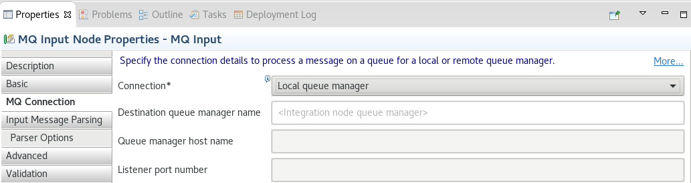

# ace-remoteQM-policy
Non-production examples of remote default queue manager policies for ACE v11 servers; these examples are intended to illustrate 
how such policies are used and some common errors, but should not be viewed as best practice for actual deployments.

## Remote default QM overview
ACE and predecessor products have always been able to use MQ, both for explicit messaging (MQ nodes in a flow) and implicit 
usage for state storage (Aggregate nodes, etc), and historically this required a local queue manager to be co-located with 
the ACE servers. IIB v10 enabled client links to remote queue managers for the explicit usage, with MQEndpoint policies for
the various MQ nodes; ACE v11 has taken this further by allowing a remote queue manager to be used by default, with no extra
configuration on the MQ nodes, and also allowing remote queue managers for Aggregate and other nodes.
 
Product docs at https://www.ibm.com/docs/en/app-connect/11.0.0?topic=mq-using-remote-default-queue-manager explain this in
more detail, and https://community.ibm.com/community/user/integration/viewdocument/when-does-ace-need-a-local-mq-serve also
describes when a local queue manager might still be needed.

For the MQ nodes, the configuration is the same as it would be for a local default queue manager:

 
and although the properties say "Local queue manager" for historical reasons, the node will in fact use a remote default
queue manager (and will fail to start if no queue manager (either local or remote) is configured).
 
## Explain how policies are actually just XML files on disk that can be copied, generated, modified, etc without needing a BAR file
 TODO
 
## server.conf.yaml example
 TODO
 
## Overrides versus run
 TODO

## Credentials; need for setdbparms or mqsicredentials before server starts up
 TODO

## Startup for remote default; when the server does different things, what errors can happen when, etc.
 TODO

## Auto-shutdown
 TODO
